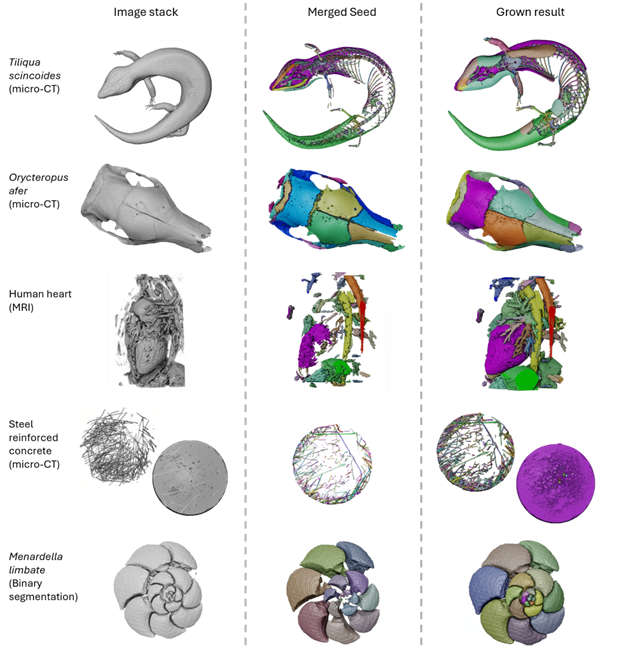

# SPROUT (Semi-automated Parcellation of Region Outputs Using Thresholding and Transformation): an adaptable computer vision tool to generate 3D segmentations


- [Introduction](#introduction)
- [Prerequisites](#prerequisites)
- [Recommended Tools](#recommended-tools)
- [Usage](#usage)
  - [Input Data Format](#input-data-format)
  - [Seed Generation](#seed-generation)
  - [Merged Seed Generation](#merged-seed-generation)
  - [Seed Growth](#seed-growth)
  - [Batch Processing Pipelines](#batch-processing-pipelines)
- [Visualization & Editing](#check-seeds-and-results-visualization--editing)
   - [Visualize by Meshes](#visualize-by-meshes)
   - [Avizo Addons](#avizo-addons)
- [Advanced Tools & Features](#advanced-tools--features)
   - [Helper Functions](#helper-functions)
   - [Parallelization Support](#parallelization-support)
   - [BounTI Multithreaded Implementation](#bounti-multithreaded-implementation)
   - [Unzipping Morphosource Zip Files](#miscellaneous-unzipping-morphosource-zip-files)
- [Demo Results](#demo-results)

## Introduction

**SPROUT: Semi-automated Parcellation of Region Outputs Using Thresholding and Transformation**  
SPROUT is a tool for parcellating segments from **3D scans** (e.g., micro-CT, MRI, and other imaging data) using semi-automated seed generation and growth. It can be applied to a diverse range of datasets, from **skulls and entire skeletons** (e.g., isolating individual bones) to **organs and man-made structures** (e.g., concrete blocks). 

New in February 2025: SPROUT now supports 2D bio-images.

Example applications and method details are provided in:  
**Y. He, M. Camaiti, L.E. Roberts, J.M. Mulqueeney, M. Didziokas, A. Goswami. 2024.**  
[*Introducing SPROUT (Semi-automated Parcellation of Region Outputs Using Thresholding and Transformation): an adaptable computer vision tool to generate 3D and 2D segmentations.*](https://www.biorxiv.org/content/10.1101/2024.11.22.624847v1.abstract)  

SPROUT builds on the concepts from **BounTI**, a boundary-preserving threshold iteration approach:  
**M. Didziokas, E. Pauws, L. Kölby, R. H. Khonsari, M. Moazen. 2024.**  
[*BounTI: A user-friendly tool for automatic hard tissue segmentation.*](https://pubmed.ncbi.nlm.nih.gov/38760955/) *Journal of Anatomy 245, 829–841*.


## Prerequisites

1. **Python and Environment Setup**
   - **Install Python**: If Python is not already installed, we recommend downloading the [Anaconda distribution](https://www.anaconda.com/products/distribution). After providing your email, follow the download link and select the version suitable for your operating system.
   - **Set up Python Environment**:
     - For Windows users with Anaconda, open the **Anaconda Prompt** from the Start menu.
     - For other installations, open a terminal with Python access.

2. **Create and Configure Python Environment**
   - SPROUT supports **Python 3.10**. Required libraries and versions are:
     ```
     NumPy: 1.26.4
     Pandas: 2.2.1
     Scikit-image: 0.22.0
     Tifffile: 2024.2.12
     Pyyaml: 6.0.1
     Trimesh: 4.3.1
     Matplotlib: 3.8.3
     open3d: 0.18.0
     ```
   - Steps to create the environment:
     1. **Create the environment**:
        ```bash
        conda create -n sprout python=3.10
        ```
     2. **Activate the environment**:
        ```bash
        conda activate sprout
        ```
     3. **Install dependencies**:
        ```bash
        pip install numpy==1.26.4 pandas==2.2.1 scikit-image==0.22.0 tifffile==2024.2.12 pyyaml==6.0.1 trimesh==4.3.1 matplotlib==3.8.3 open3d==0.18.0
        ```

### Recommended Tools

1. **MeshLab**  
   - MeshLab is a tool for viewing 3D meshes generated by SPROUT.

2. **Optional Visualization Tools**  
   - 3D: Tools like **DragonFly** or **Avizo** can be used to visualize and manipulate SPROUT's segmentation results.
   - 2D: Tools like **ImageJ** can be used to visualize and manipulate SPROUT's 2D segmentation results.


## Usage


SPROUT’s workflow consists of three main steps :
1.	Seed Generation: Create segmentations of individual components within a 3D volume by separating target regions through thresholding and erosion.
2.	Candidate Seed Selection: Review and select the most suitable seed for the next step.
3.	Growth: Grow the candidate seed to match the target regions.


A detailed tutorial with step-by-step instructions and screenshots is available in the [`./material/`](./material/) directory.


### **Input Data Format**
SPROUT processes 2D and 3D grayscale images stored in **TIFF (`.tif`, `.tiff`) format**. 

- **Supported file types:** `.tif`, `.tiff`
- **Image Type:** 2D or 3D grayscale images
- **Bit Depth:** 8-bit, 16-bit, or 32-bit (floating point)
- **File Structure:**  
   - 2D images: `(Height, Width)`
   - 3D images: `(Depth, Height, Width)`

**Unsupported inputs:** Color images, compressed TIFFs, and multi-frame (time-series) TIFFs.


Demo data for the tutorial can be found in the [`./data/`](./data/) directory and [here](https://zenodo.org/records/14358829).


### Seed Generation
Use thresholds, morphological transformations and connected components to separate specimen into target regions

#### **`make_seeds.py`**  
`make_seeds.py` is the for generating seeds. 
   - **Usage**: An example YAML configuration file can be found at `./template/make_seeds.yaml`.
      - Run with the default configuration:  
         `python make_seeds.py`  
         *(Reads the `./make_seeds.yaml` file)*  
      - Run with a custom configuration:  
         `python make_seeds.py <config>.yaml`

   - **Key Parameters**:  
      I/O Parameters:
      - `workspace`: Base folder for all input and output files.  
      - `file_name`: Path to the input image.  
      - `output_folder`: Folder to save the generated seeds.    

      Seed Generation Settings:
      - `thresholds`: Thresholds for creating binary masks in seed generation process. `mask = input >= threshold`. 
      - `ero_iters`: Number of erosion iterations.  
      - `segments`: Number of largest disconnected components to retain (≥1).  
      - `num_threads`: Number of threads for parallel processing (recommended to match `target_thresholds`).  
      - `footprints`: Shape of the erosion footprint:
         - `'ball'` and `'cube'`: Erosion in all directions.  
         - `'ball_XY'`, `'ball_XZ'`, `'ball_YZ'`: Erosion in specific planes.  
         - `'X'`, `'Y'`, `'Z'`: Erosion along specific axes.  

      Optional Settings:
      - `boundary_path`: Path to boundary mask, which helps to define non-target region explicitly. Defaults is None.
      - `upper_thresholds`: A list of upper thresholds used to create binary masks. Default is None, if provided, the mask is defined as `mask = (input >= threshold) & (input <= upper_threshold)`. 

#### **`make_seeds_all.py`**  
Similar to `make_seeds.py` in usage and configuration, but does not require specifying `footprints`. It automatically generates seeds using predefined footprints: `'ball'`, `'ball_XY'`, `'ball_XZ'`, and `'ball_YZ'`. 

   - **Usage**: An example YAML configuration file can be found at `./template/make_seeds_all.yaml`.
      - Run with the default configuration:  
         `python make_seeds_all.py`  
         *(Reads the `./make_seeds_all.yaml` file)*  
      - Run with a custom configuration:  
         `python make_seeds_all.py <config>.yaml`

#### Merged Seed Generation
`make_seeds_merged.py` is an algorithm designed for generating seeds through an automated merging process. This algorithm can:
   - Detect separations within a segmented region.
   - Retain regions that might be disappear when increasing threshold value or erosion.
   <br>
   <br>
   - **Usage**: An example YAML configuration file can be found at `./template/make_seeds_merged.yaml`.
      - Run with the default configuration:  
         `python make_seeds_merged.py`  
         *(Reads the `./make_seeds_merged.yaml` file)*  
      - Run with a custom configuration:  
         `python make_seeds_merged.py <config>.yaml`

#### Types of Merged Seed Generation:
The type of process depends on the input parameters:

1. **Threshold-Based Process**:  
   If a list of thresholds is provided, the merged seeds will be generated across seeds from different thresholds and the same erosion settings.

2. **Erosion-Based Process**:  
   If a single threshold or a list containing just one threshold is provided, the merged seeds will be generated across seeds from no erosion to the target erosion while keeping the same threshold.


### Seed Growth

**`make_grow_result.py`**, grows seeds back to the original images using thresholds.

   - **Usage**: An example YAML configuration file can be found at `./template/make_grow_result.yaml`.
      - Run with the default configuration:  
         `python make_grow_result.py`  
         *(Reads the `./make_grow_result.yaml` file)*  
      - Run with a custom configuration:  
         `python make_grow_result.py <config>.yaml`

   - **Key Parameters**:  
      I/O Parameters:
      - `workspace`: Base folder for all input and output files.  
      - `img_path`: Path to the input image.  
      - `seg_path`: Path to the seed file.  
      

      Growth Settings:
      - `thresholds`: A list of thresholds used to create binary masks for the growth process, where `mask = input >= threshold`. Growth begins at higher thresholds to ensure better control and avoid overgrowth. 
      - `dilate_iters`: List of integers specifying dilation iterations for each threshold.  
      - `touch_rule`: (Default: `"stop"`) Rule for handling overlaps during growth.  
      - `save_interval`: Interval for saving intermediate results. 
      - `num_threads`: Number of threads

      Optional Settings:
      - `boundary_path`: Path to boundary mask, which helps to define non-target region explicitly. Defaults is None.
      - `upper_thresholds`: A list of upper thresholds used to create binary masks for the growth process. Default is None, if provided, the mask is defined as `mask = (input >= threshold) & (input <= upper_threshold)`. 
      - `to_grow_ids`: Specify segmentation classes to grow, default is growing on all ids
      - `grow_to_end`: Whether grow the seed match the thresholded binary mask as close as possible. It will override the dilate_iters. Default False.
      - `tolerate_iters` Early stopping: limit for consecutive no-growth iterations. Defaults is 3.
      - `min_diff`: The minimum difference to consider a growth in a dilation iteration. Default is 50


   - **Features**:  
      - Gradual growth from high to low thresholds prevents overgrowth issues.
      - Supports early stopping if the size increase is below a minimum threshold (default: 50 voxels) for a set number of iterations (default: 3 consecutive iterations).


### Batch Processing Pipelines

#### **`PipelineSeed.py`**  
   This script is used for batch seed generation, including the creation of seeds and merged seeds. 

   - **Usage**: An example YAML configuration file can be found at `./template/PipelineSeed.yaml`.
      - Run with the default configuration:  
         `python PipelineSeed.py`  
         *(Reads the `./PipelineSeed.yaml` file)*  
      - Run with a custom configuration:  
         `python PipelineSeed.py <config>.yaml`

   - **Input CSV**:  
     The batch processing CSV file can be found at `./template/seeds_input.csv`. The `img_path` column is mandatory, specifying the path to the input images. Other parameters, such as `seed_threshold`, `boundary_path` and `ero_iters`, are optional and can be set on a per-file basis in the CSV.

   This pipeline offers flexibility and scalability for large-scale seed generation tasks.

#### **`PipelineGrow.py`**  
   This script is designed for batch processing of growth operations on seeds.

   - **Usage**: An example YAML configuration file can be found at `./template/PipelineGrow.yaml`.
      - Run with the default configuration:  
         `python PipelineGrow.py`  
         *(Reads the `./PipelineGrow.yaml` file)*  
      - Run with a custom configuration:  
         `python PipelineGrow.py <config>.yaml`

   - **Input CSV**:  
   The batch processing CSV file is located at `./template/grow_input.csv`. The `img_path` and `seg_path` columns are mandatory, specifying the path to the input images and candidate seeds. Other parameters, such as `thresholds`, `boundary_path` and `dilate_iters`, are optional and can be set on a per-file basis in the CSV.

## Check Seeds and Results: Visualization & Editing

### Visualize by Meshes
You can visualize, check, and edit seeds or results using tools like **3D Slicer**, **DragonFly**, and **AVIZO**, or create meshes for use in **MeshLab**.

- **`make_mesh.py`**:  
  Generates meshes for each class from the input seeds or results. Customize input/output paths via `make_mesh.yaml`. Outputs include:
  - Individual `ply` meshes with segmentation IDs (e.g., `1.ply`, `2.ply`).
  - `merged.ply`: Combined mesh of all classes.
  - `merged_n_to_m`: Merged meshes for classes grouped by tens.

- **`plot_mesh.py`**:  
  Visualizes the generated meshes.  
  *Note: Currently under testing.*

Meshes use a 10-color cyclic colormap, where class IDs 1–10 map to distinct colors and repeat for IDs beyond 10.  


### Avizo Addons
Addon scripts are saved in `./avizo` folder. 
Change the extension from `py` to `pyscro`, and drag into AVIZO's `Project View` to use it.

#### **`PreProcess.py`**  
It is a script designed for pre-processing images based on the skull-suture workflow. It simplifies the pre-processing pipeline by combining multiple functions into a single add-on, eliminating the need to open multiple functions in AVIZO. 

When setting up the input in the add-on UI, the following operations can be performed:
- **Cropping**: Define a region of interest to focus on specific parts of the image.
- **Swapping Axes**: Reorient the volume by swapping axes as needed.
- **Resampling**: Scale voxel sizes to adjust the resolution of the dataset.
- **Converting to 8-bit**: Reduce the bit depth of the image for standardization or compatibility.

Additionally, it automatically creates all essential objects useful for preprocessing, such as:
- Volume rendering
- Ortho-slices
- Axes
- Bounding boxes

**Transformations (e.g., rotations)** are not currently supported and must be performed separately.


#### **`LoadVisFiles.py`**  

It is a script designed to batch process and visualize segmentation labels in AVIZO.

- **Batch Loading and Conversion**: Load and convert 8-bit segmentation labels into AVIZO in a single batch, streamlining the workflow. Supports reordering material/class IDs based on size using AVIZO's `reorder` function. Some AVIZO versions may not support the reorder function. In such cases, simply untick the reorder option during processing.
- **Visualization Options**: Provides options for visualizing segmentation labels in either voxel or mesh format, enabling flexible data exploration.
- **Material Name Mapping**: Outputs the relationship between material names and their corresponding segmentation classes, ensuring clarity and traceability during visualization.

#### **`Edit.py`**  

Performs the same tasks described in the [Helper Functions for Editing](#helper-functions-for-editing) section, combining multiple editing operations into a single script for convenience.


## Advanced Tools & Features

### Helper Functions

#### Editing scripts
Editing scripts for segmentations (seeds and results) are provided in the `./help_functions/` folder:

- **`filter_class.py`**: Retains only the specified IDs in a segmentation.
- **`merge_class.py`**: Merges a list of IDs into a single ID in a segmentation.
- **`merge_imgs.py`**: Merges two segmentations (IDs for each segmentation can be specified).
- **`sort_and_filter_seg_by_size.py`**: Orders segments by size and removes those smaller than a given size.
- **`split_class.py`**: Splits a segment into multiple segments if separations (disconnected components) exist.

#### Processing files

- **`read_tiff_to_csv.py`**: Reads `.tif` or `.tiff` files from specified folders (e.g., `img`, `seg`, and `boundary`), aligns them based on filenames, and outputs a CSV file. This CSV file can then be used as input for pipeline scripts. Options are provided to handle prefixes and suffixes for alignment.

### Parallelization Support

All SPROUT scripts (`make_seeds.py`, `make_seeds_all.py`, `make_seeds_merged.py`, `make_grow_result.py`, `make_mesh.py`, `PipelineSeed.py`, `PipelineGrow.py`) support **parallelization** using Python's `threading` library. This allows for faster execution by distributing tasks across multiple threads.

- **How It Works**:  
  You can specify the number of threads in the configuration file (`num_threads`). By utilizing multiple threads, the scripts can process data simultaneously, significantly improving efficiency for large datasets or computationally intensive tasks.

- **Recommendation**:  
  For optimal performance, set `num_threads` to match the number of CPU cores on your system.

### BounTI Multithreaded Implementation

The script `./BounTI/run_bounti_mp.py` is designed to run **BounTI** and **BounTI Flood** using a multithreaded approach. It efficiently processes a list of initial thresholds in parallel, leveraging multiple threads for improved performance.

### Miscellaneous: Unzipping Morphosource Zip Files

The following scripts provide utilities for handling Morphosource datasets in the `./help_functions/` folder::

- **`morphosource_unzip.ipynb`**: Jupyter Notebook version for interactive use.
- **`morphosource_unzip.py`**: Python script for command-line usage.

#### Functionality:
- Unzips all `*.zip` files from a specified input folder to a target output folder.
- Logs important details for each file, including:
  - Path of the original `.zip` file.
  - Path of the extracted contents.
  - Status of the extraction (success/failure).
- Supports batch unzipping of Morphosource datasets in a folder.

#### Morphosource File Structure:
These scripts handle the expected Morphosource file structure, ensuring extracted files are well-organized for subsequent processing.


## Demo Results

SPROUT has been successfully applied to a variety of datasets, including:
- **Micro-CT full skeleton**
- **Micro-CT skull**
- **MRI heart**
- **Micro-CT concrete**
- **Binary segmentation of Forams**

The image below illustrates the outcomes from left to right:
1. **Volumetric Representations**: Visualizations of the original image stacks.
2. **Merged Seeds**: Results after applying SPROUT's segmentation and merging processes.
3. **Grow Results**: Results after growing on the candidate seeds



## TODO

### Filter Seeds/Results using segmentation stats
TODO This is used to filter out seeds that are not likely to be checked.
Working on the `./seeds_stats.py`, and based on the method in `./make_seeds_foram.py` and `./make_seeds_merged.py`.