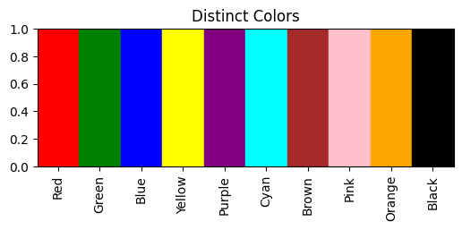

## A pipeline for generating segmentaions on micro-CT scans

The code is highly inspired by Bounti.
It is used to separate parts for 3D scans
Here have three main parts.
1. Generate seeds  
Use morphological transformations and connected components (initial segmentations for grow)
    1. `make_seeds.py` is the for generating seeds. Config file template: `make_seeds.yaml` 
        - workspace: The folder for the data
        - file_name: path to input image
        - num_threads: multiple threads
        - target_thresholds: 0 for binary segmentation. For images, it's a threshold for segmenting the images
        - ero_iters: Iterations for erosion
        - segments: Integer >=1, Top <segments> largest disconnected componenets
        - output_seed_folder:
        - output_log_file: Name of the output file name
        - footprints: The way you want to erode your images, current supports "ball" and "cube" :Erosion all directions. 'ball_XY', 'ball_XZ', 'ball_YZ': Erosion on the Plane. 'X', 'Y', 'Z': Erosion on the axis.

     

    2. `make_seeds_foram.py` is the algorithm for generating seeds for the binary segmentation of foram chambers. Fully automatic

2. Grow back to the full
    1. `make_grow_result.py` To grow the seeds to back to the original images with thresholds, or grow back to the binary segmentation 
    `make_grow_result.yaml`. 
     
     
    For input is image, the code supports growing on a list of thresholds. Normally from high (can grow to less regions) to low (can grow to more regions). The reason of doing this is not making the grow straight on the final result (i.e., the optimal threshold), as it would often causing some parts will overgrown on other parts. Making graduate grow, it can lower the chances of the overgrown problem.
     
     
    Supports early stopping. For a given grow loop (e.g., 10 iters), if there aren't a minimum increase (e.g., 100 voxel) on size after growing for a consecutive iterations (e.g., 3 consecutive iterations), 

3. Visualization 
    1. `make_mesh.py` Create a mesh for every class for the input seed/result 
    Can change `make_mesh.yaml` values to set the input, and output directory
    A folder of seeds/results
    One seed/result
     
     
    Output includes components `ply` meshes with its segmentation id. e.g. `1.ply`, `2.ply`. A `merged.ply` with all the meshes combined. And files called `mergedx_to_y`, merged mesh with only including the mesh colours for every 10 classes.

    
    2. `plot_mesh.py` Plot Generated meshes.  
    Currently under testing

    The current colourmap has 10 colours, mesh colours follow its order, and recur using them after more than 11. 

4. Suture generation
    
    Run `./make_sutures.py`. 

    Input: two CSV. 

        1. One contains segmentation file names, and segmentation class id to each bone names. E.g., `./template/bone_ids.csv`
        2. Another spreadsheet have three columns. E.g., `./template/suture_bone_mapping.csv`
            (1) the suture names(col: result), 
            (2) the first bone making the suture (col:part_1)
            (3) the second bone making the suture (col:part_2). 

    Output: 
    For each scan:

        1. Separated suture segmentation are generated in a folder (0: background, 1: sutures).
        2. Merged sutures segmentation.
        3. CSV file of suture names, parts, output detail, merged suture ID

    A Merged CSV of the CSV file for each scan.
    

4. Pipelines
    1. Seed generation and making meshes. Run `./PipelineSeedMesh.py`, and an example config file is `./PipelineSeedMesh.yaml`

    2. Growing and making meshes. Run `./PipelineGrowMesh.py`, and an example config file is `./PipelineGrowMesh.yaml`

## Filter Seeds/Results using segmentation stats
This is used to filter out seeds that are not likely to be checked.

## TODO:
2024/08/03
- Visualiasaion: Same x colour for visluse, Done
- To add different pattern (texture or material) for visualisation. Some have been implemented in `./make_mesh.py`
- Make a mesh that have unique colours (Combined), Done
- Upgrade mesh visualisation. Ask marco what could be done.
- UV on mapping texuture, testing code in `check_seeds.ipynb`

- stats , working on the `./seeds_stats.py`, and based on the method in `./
make_seeds_foram.py`

seed makeing, more option on loop, footprints, 
also allow cleaning on the seeds

AVIZO addon test

 
## BounTI multithread implementation
`./BounTI/run_bounti_mp.py` is used to run BounTI and BounTI flood, with a list of initial thresholds. 

## Avizo scripts
Addon scripts are saved in `avizo` folder. 
Change the extension from `py` to `pyscro`, and drag into Avizo project view to use

`LoadVisFiles.py`  
- Load and convert 8-bit labels into Avizo in batch.
- Allow users to visualise the labels in voxel or mesh

`Edit.py` 
- For a given label, merge multiple classes into one class. 
- For two labels, merge two labels, using input classes for these two labels

### TODO (might need to ask AVIZO Customer service)
1. Set the correct voxel size in crop editor. As crop editor is a pop up menu

### Edit seeds tool

## Help functions:
Merge classes in one image
Merge classes from two images
Remove classes

## Parallelization:
`make_mesh.py`, `make_seeds.py`, `make_seeds_foram.py` currently support running in multiple processes. Please check your CPU and set the right `num_threads` in the configuration file

## Unzip a list of morphosource zip files
`morphosource_unzip.ipynb` 
`morphosource_unzip.py` .
- Unzip all the `*.zip` files from a given folder (input folder) to a target folder
- Save the unzip log. zip file path, unzip path, whether the unzip is success.
Unzip all morphosource in a folder/

Morphosource file structure.

