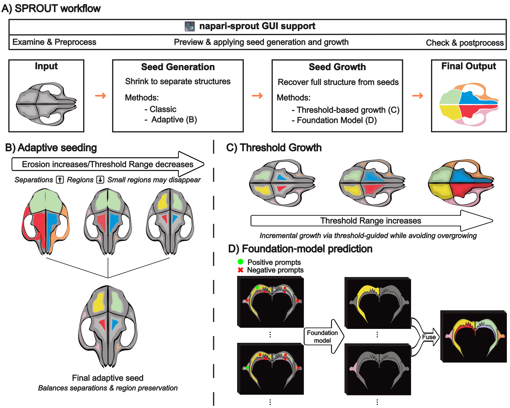
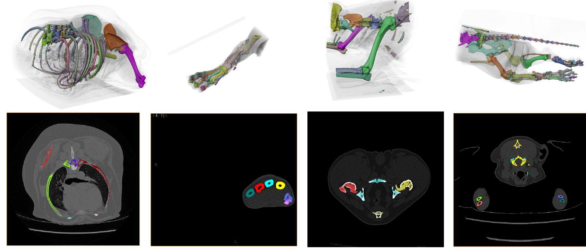
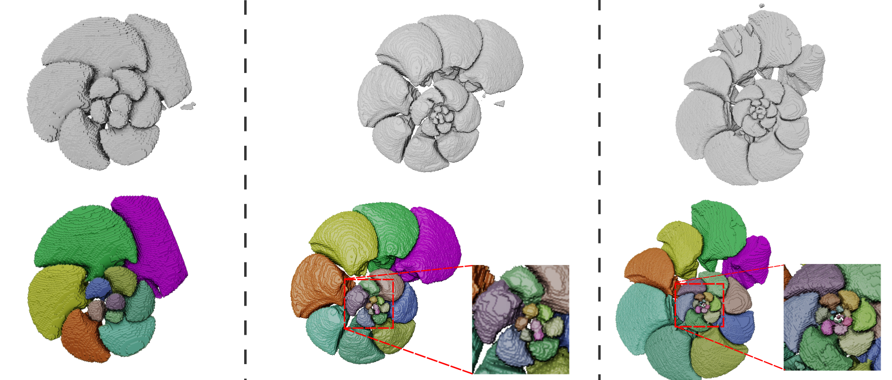
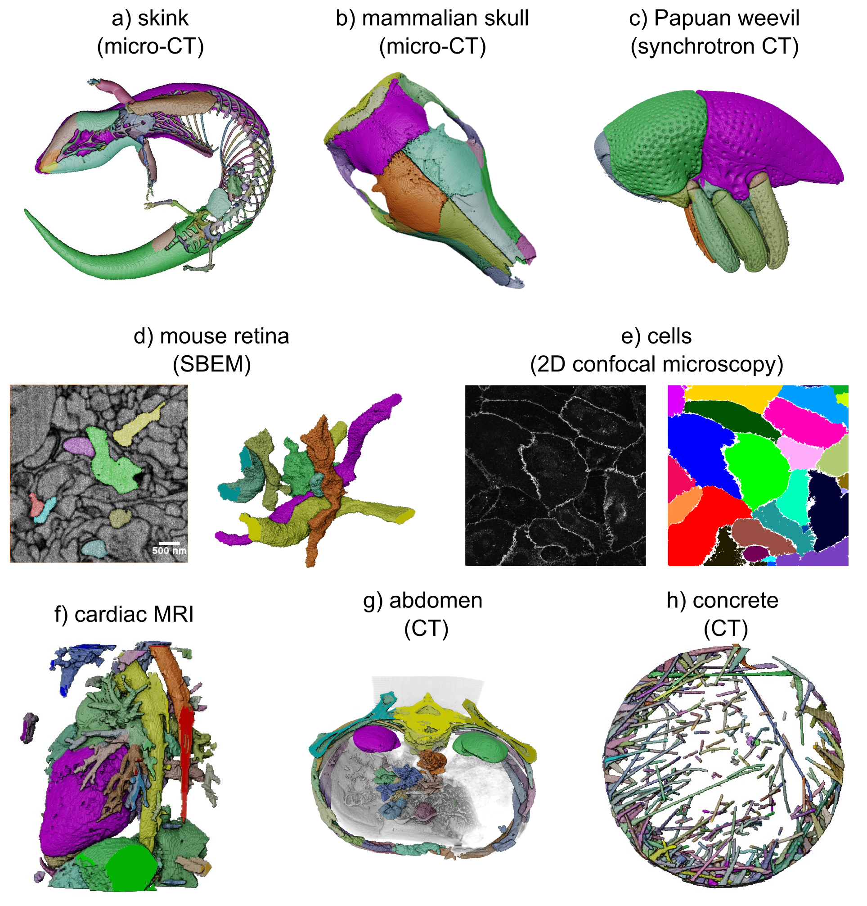

# SPROUT

## TL;DR 
SPROUT is a lightweight segmentation toolkit for fine-grained and multi-part segmentation of grayscale 2D/3D images.

👉 Quickstart: [Quickstart with Demo Data](./docs/demo_data_tutorial.md)

Video demo — Getting started with GUI-supported SPROUT using napari:
<a href="https://www.youtube.com/watch?v=6rA7wW6f0SU" target="_blank">
  
</a>

Click [here](https://www.youtube.com/watch?v=4DHI1gs1lzc&list=PL8tsvVKJ9n6FjYYplo-IAwKBLxDh578aj) for the playlist of all SPROUT videos (mainly focus on GUI-based SPROUT in napari). See [Usage](#️-usage) section for command-line usage.

---

- [Introduction](#introduction)
- [Prerequisites](#prerequisites)
   - [Install SproutSAM](#sproutsam)
   - [Install Napari & napari-sprout (Visualization and Editing)](#napari--napari-sprout-visualization-and-editing)
- [Usage](#️-usage)
   - [Input Data Format](#input-data-format)
   - [Quickstart with Demo Data](#quickstart-with-demo-data)
   - [Seed Generation](#-run-seed-generation)
   - [Adaptive Seed Generation](#-run-adaptive-seed-generation)
   - [Growth](#-run-growth)
   - [Foundation Model Segmentation](#-sproutsam-run-foundation-model-prediction)
- [View & Edit (napari)](#view--edit-napari)
- [Demo Results](#demo-results)
- [Extras](#extra-features)

## Introduction

**SPROUT (Semi-automated Parcellation of Region Outputs Using Thresholding and Transformation)**  
SPROUT is an interpretable workflow for semi-automated, multi-class segmentation of volumetric images (e.g., CT, MRI). It requires no training data and is designed for researchers facing challenging segmentation tasks, such as structures with fine details or weak boundaries, where data for deep learning is scarce. 
  
**Y. He, M. Camaiti, L.E. Roberts, J.M. Mulqueeney, E. Ioannou, M. Didziokas, A. Goswami. 2024.**  
[*SPROUT: A User-friendly, Scalable Toolkit for Multi-class Segmentation of Volumetric Images*](https://www.biorxiv.org/content/10.1101/2024.11.22.624847v2.abstract)  


## Prerequisites

1. **Python and Environment Setup**
   - **Install Python**: If Python is not already installed, we recommend downloading the [Anaconda distribution](https://www.anaconda.com/products/distribution). After providing your email, follow the download link and select the version suitable for your operating system.
   - **Set up Python Environment**:
     - For Windows users with Anaconda, open the **Anaconda Prompt** from the Start menu.
     - For other installations, open a terminal with Python access.

2. **Create and Configure Python Environment**
   - SPROUT supports **Python 3.10**. Required libraries and versions are:
     ```
     NumPy: 1.26.4
     Pandas: 2.2.1
     Scikit-image: 0.22.0
     Tifffile: 2024.2.12
     imagecodecs: 2025.3.30
     Pyyaml: 6.0.1
     Trimesh: 4.3.1
     Matplotlib: 3.8.3
     open3d: 0.18.0
     ```
   - Steps to create the environment:
     1. **Create the environment**:
        ```bash
        conda create -n sprout python=3.10
        ```
     2. **Activate the environment**:
        ```bash
        conda activate sprout
        ```
     3. **Install dependencies**:
        ```bash
        pip install numpy==1.26.4 pandas==2.2.1 scikit-image==0.22.0 tifffile==2024.2.12 pyyaml==6.0.1 trimesh==4.3.1 matplotlib==3.8.3 open3d==0.18.0 imagecodecs==2025.3.30
        ```
        This shows pip installation; alternatively, you can use conda.

### **SproutSAM**

[**SproutSAM**](#-sproutsam-run-foundation-model-prediction) is an optional module that enables prompt-based segmentation using foundation models like [SAM](https://github.com/facebookresearch/segment-anything) and [SAM2](https://github.com/facebookresearch/sam2). If you wish to use **SproutSAM**, please install the following additional dependencies:

#### Core Dependencies

```bash
pip install torch torchvision torchaudio
pip install opencv-python-headless
```

⚠️ For optimal performance, we recommend using GPU-enabled PyTorch. You can find the correct installation command based on your system here:  
[https://pytorch.org/get-started/locally/](https://pytorch.org/get-started/locally/)

#### 📦 Install Segment Anything Models

You also need to install the SAM and/or SAM2 libraries:

-   **[SAM (Segment Anything Model)](https://github.com/facebookresearch/segment-anything)**
    
    ```bash
    git clone https://github.com/facebookresearch/segment-anything.git
    cd segment-anything
    pip install -e .
    ```

-   **[SAM2 (Segment Anything v2)](https://github.com/facebookresearch/sam2)**

    ```bash
    git clone https://github.com/facebookresearch/sam2.git
    cd sam2
    pip install -e .
    ```

### Napari & napari-sprout (Visualization and Editing)

**[Napari](https://napari.org/)** is an open-source image viewer designed for 2D and 3D visualisation and interactive manipulation.

We developed `napari-sprout`, the SPROUT plugin for Napari, which enables users to interactively visualise, edit, and refine seeds, segmentation results, and other image-derived layers.

`napari-sprout` has been tested with **`napari==0.6.1`**.

To install Napari, you can use either **pip** or **conda**:

```bash
pip install napari==0.6.1
```
or
```bash
conda install -c conda-forge napari=0.6.1 pyqt
```

After installation, you can launch Napari from the command line:

```bash
napari
```

If you encounter the following error message:

```
napari requires either PyQt5 (default), PyQt6 or PySide2 to be installed in the environment.
```

it means a **Qt GUI** is missing.  
You can fix this by installing one of the following:

-   With **pip**:
    
    ```bash
    pip install "napari[all]"
    # or a specific Qt backend:
    pip install "napari[pyqt5]"
    pip install "napari[pyqt6]"
    pip install "napari[pyside2]"
    ```
    
-   With **conda**:
    
    ```bash
    conda install -c conda-forge pyqt
    # or
    conda install -c conda-forge pyside2
    ```


#### Install The SPROUT plugin (`napari-sprout`):
After installing napari, you can proceed to install the SPROUT plugin.
```bash
cd ./napari_sprout
pip install -e .
```

- More on using napari-sprout: see [View & Edit (napari)](#view--edit-napari)
- Full napari docs: [https://napari.org/](https://napari.org/)


## ⚙️ Usage

SPROUT follows a **two-step workflow** for multi-class segmentation:




1. **Seed Generation**  
   The goal of this step is to reduce the regions of the image by breaking it into multiple distinct components (splits). There are two strategies:
   
   - [**Vanilla seed generation**](#-run-seed-generation): generate multiple seeds by varying configurations such as thresholds and erosion steps.
   - [**Adaptive seed generation**](#-run-adaptive-seed-generation): automatically combine information across seeds from different configurations to produce a often better and final seed.
2. **Seed Growth**  
   - [**Threshold-based growth**](#-run-growth): grows a seed by expanding the reduced components back toward their full target shapes. Growth is guided by image intensity and connectivity.
   - [**SproutSAM**](#-sproutsam-run-foundation-model-prediction): seeds are converted into prompts for a segmentation foundation model such as SAM, which then predicts the segmentation. These slice-wise predictions are then fused into a final 3D output.

**🧪 Interactive Inspection & Editing**

In practice, both seed and grow results often require **visualisation, quality checking, or manual editing**, depending on your segmentation goals.

To support this, SPROUT is fully integrated into the **Napari** ecosystem as a plugin, please see [napari-sprout](#view--edit-napari). 


### **Input Data Format**
SPROUT processes 2D and 3D grayscale images stored in **TIFF (`.tif`, `.tiff`) format**. 

- **Supported file types:** `.tif`, `.tiff`
- **Image Type:** 2D or 3D grayscale images
- **Bit Depth:** 8-bit, 16-bit, or 32-bit (floating point)
- **File Structure:**  
   - 2D images: `(Height, Width)`
   - 3D images: `(Depth, Height, Width)`

**Unsupported inputs:** Color images.

### Quickstart with Demo Data

See [Demo Data and Basic Usage](docs/demo_data_tutorial.md) for a quick start.

See [Scenarios](docs/scenarios.md) for advance usage in a Q&A style.   

`./demo_data` includes a **dog skeleton** `dog_img.tif`, a **foraminifera chamber segmentation** `foram_img.tif` and a **2D cell microscopy image** `2d_cell.tif`. Their corresponding seed images are also provided in the same directory. 

Additional demo data can be found [here](https://zenodo.org/records/16857648).

### 🌰 Run seed generation

**on a single image**
```bash
python sprout.py --seeds --config path/to/seed_config.yaml
```
**in batch mode**
```bash
python sprout.py --seeds --batch --config path/to/batch_seed.yaml
```

A video explain batch mode: [link](https://www.youtube.com/watch?v=5o-PJ34Yirc)

For full details on YAML parameters and other configs see:
- [Seed configuration options](./docs/config_seed.md)

For example, see the YAML configuration files in `./template/`.

### 🧠 Run Adaptive Seed Generation

**on a single image**
```bash
python sprout.py --adaptive_seed --config path/to/adaptive_seed_config.yaml
```

**in batch mode**

```bash
python sprout.py --adaptive_seed --batch --config path/to/batch_adaptive_seed.yaml
```

For full details on YAML parameters and other configs see:

-   [Adaptive seed configuration options](./docs/config_adaptive_seed.md)
    

For example, see the YAML configuration files in `./template/`.

### 🌱 Run Growth

**on a single image**
```bash
python sprout.py --grow --config path/to/grow_config.yaml
```
**in batch mode**
```bash
python sprout.py --grow --batch --config path/to/batch_grow.yaml
```

For full details on YAML parameters and other configs see:
- [Growth configuration options](./docs/config_grow.md)

For example, see the YAML configuration files in `./template/`.

### 🧠 SproutSAM: Run Foundation Model Prediction

**on a single image or a folder of images**
```bash
python sprout.py --sam --config path/to/config.yaml
```

**in batch mode**
```bash
python sprout.py --sam --batch --config path/to/batch_config.yaml
```
For full details on YAML parameters and other configs see:
- [Foundation Model configuration options](./docs/config_sam.md)

For example, see the YAML configuration files in `./template/`.

### ⚡ Parallelization Support

`sprout.py` can run tasks in parallel using Python’s `threading`. Just set `num_threads` in your config to speed up processing, especially for large datasets.


## View & Edit (napari)

🎥 **Tutorial Video — Editing Segmentation Results in napari-SPROUT**  
<a href="https://www.youtube.com/watch?v=H9pLkmy6WwA" target="_blank">
  
</a>

To launch **napari-sprout**:

1. Start napari by running `napari` in a terminal or command prompt.
2. Open the `napari-sprout` plugin from the napari menu: Plugins → SPROUT.

From here, you can use a set of tools to load, view, and edit your data.  

-   **SPROUT_main**  
    GUI for running **seed generation**, **adaptive seed generation**, and **growth**.  
    Parameters match those used in the command-line scripts.
    
-   **SPROUT_load**  
    Batch loader for multiple images or segmentations.
    
-   **SPROUT_edit**  
    Interactive editing of segmentation results such as:
    
    -   Click to keep or remove regions
        
    -   Re-assign class numbers (e.g. merge `i → j`, delete `i → 0`)
        
    -   Split disconnected regions
        
-   **SPROUT_map**  
    Map regions to a semantic class scheme, e.g. `1 → bone_1`, `2 → bone_2`.
    
-   **SPROUT_tools**  
    Miscellaneous tools, including:
    
    -   Inspect reference shapes (e.g. show a ball of radius 10 pixels)
        
    -   Generate batch-processing CSVs, can provide per-image adaptive thresholds (e.g. Otsu)
        
-   **SPROUT_info**  
    Inspect information (e.g., resolutions, how many segmentation classes) of images or segmentations.


In addition to `napari-sprout`, **napari** also provides powerful editing options (e.g. **Brush** to add regions, **Erase** to remove).


You can also visualize, inspect, and edit seeds or results using 3D image processing tools such as **3D Slicer**, **DragonFly**, and **AVIZO**. Alternatively, you can generate meshes and view or edit them in mesh-based tools like **MeshLab**. See [Extra section](#extra-features)


## Demo Results

Batch processing results of segmenting dog bones in CT scans with varying anatomy and postures.



Batch processing results of segmenting foram binary segmentation (supports segmentation masks as input too) with variable numbers of chambers


Gallery of other results



_Note: All results underwent manual post-processing primarily to verify and correct segmentation errors._


----------
## Extra Features

### Other Optional Tools
You can use other tools to visualize and edit SPROUT's segmentation results, see [Optional Tools](./docs/supplementary_extra_plugins.md) for details.

### Helper Functions
In napari-sprout and plugins, we provided GUI version of editing results. You can also find the script-version in [Helper Functions](./docs/supplementary_helper.md).

### BounTI Multithreaded Implementation

SPROUT was inspired by **BounTI**, a boundary-preserving threshold iteration approach:  
**M. Didziokas, E. Pauws, L. Kölby, R. H. Khonsari, M. Moazen. 2024.**  
[*BounTI: A user-friendly tool for automatic hard tissue segmentation.*](https://pubmed.ncbi.nlm.nih.gov/38760955/) *Journal of Anatomy 245, 829–841*.

The script `./BounTI/run_bounti_mp.py` is designed to run **BounTI** and **BounTI Flood** using a multithreaded approach. It efficiently processes a list of initial thresholds in parallel, leveraging multiple threads for improved performance.


