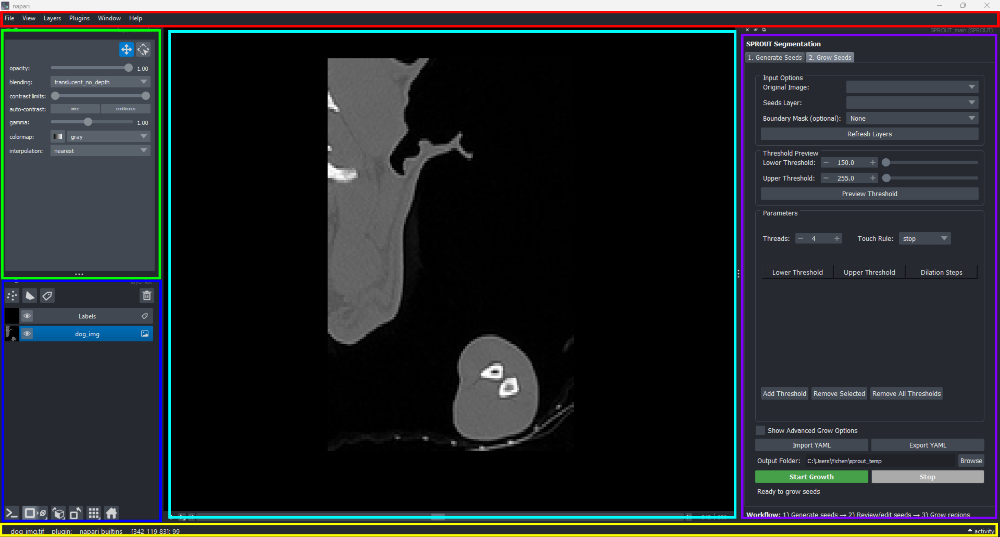

# Quick Start: napari Interface Overview (v0.6.1)

This is a simple introduction to using [napari](https://napari.org/) (tested with version 0.6.1). For more details, please check the [official documentation](https://napari.org/).

Below is a screenshot with different panels highlighted and explained:

Napari mainly consists of the following components:
- Top Menu Bar — [#top-menu-bar-red](#top-menu-bar-red)
- Layer Controls — [#layer-controls-green](#layer-controls-green)
- Layer List — [#layer-list-blue](#layer-list-blue)
- Plugin Panel — [#plugin-panel-purple](#plugin-panel-purple)
- Main Panel — [#main-panel-cyan](#main-panel-cyan)
- Status Bar — [#status-bar-yellow](#status-bar-yellow)

 <!-- Replace with proper relative path if needed. Image reference: image1 -->

---

## Top Menu Bar (Red)

- **Location:** Top of napari window.
- **Usage:**  
  - Access main actions like opening/saving files via **File**.
  - Add or manage plugins (such as *SPROUT*) in **Plugins**.
  - Find **Window** menu to reopen closed panels.
  - Other menus: **View, Layers, Help**.

---

## Layer Controls (Green)

- **Location:** Left-side, upper section.
- **Usage:**  
  - Adjust properties for the selected layer (layer will be highlighted in Layer List panel).
  - Some controls are **global** (for all layers), such as:  
    - Opacity  
    - Blending
  - Other controls depend on the type of layer:  
    - For images: adjust colormap, contrast, etc.
    - For labels: edit label, change colors, etc.
  - **Panel features:**  
    - Can be dragged, resized, or closed.
    - Reopen from **Window** menu if closed.
---

## Layer List (Blue)

- **Location:** Left-side, below Layer Controls.
- **Usage:**  
  - Manage all layers (add, remove, reorder, show/hide, select).
  - **Layer types:**  
    - `Image`
    - `Labels` (segmentation)
    - `Points`
    - `Shapes`
  - Use the buttons below the list to:
    - Open command line
    - Switch between 2D/3D view
    - Change axes mode
    - and more...
  - **Panel features:**  
    - Can be dragged, resized, or closed.
    - Reopen from **Window** menu if closed.

---

## Plugin Panel (Purple)

- **Location:** Shown when a plugin is opened (location and size can be adjusted).
- **Usage:**  
  - Shows controls for the selected plugin (e.g., *SPROUT* plugin).
  - **Panel features:**  
    - Can be dragged, resized, or closed.
    - Reopen from **Plugins** menu if closed.

---

## Main Panel (Cyan)

- **Location:** Center of napari window.
- **Usage:**  
  - Displays all visible layers, blended in stacking order.
  - **2D view:**
    - Left mouse: pan
    - Mouse wheel: zoom
    - Ctrl + wheel: scroll slices
  - **3D view:**
    - Left mouse: rotate
    - Ctrl + left mouse: pan
    - Mouse wheel: zoom

---

## Status Bar (Yellow)

- **Location:** Bottom of window.
- **Usage:**  
  - Shows info about active layer (e.g., mouse position, value).
  - Access activity log for napari output.

---

*For more information, visit the [napari documentation](https://napari.org/).*